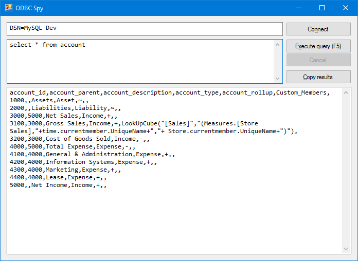

# ODBC Spy

Excel used to have this little doodad for probing ODBC connections with SQL, but it went away in newer versions. So here's a replacement which will let you query an ODBC connection and get back some CSV data. From there, if you want to put it in Excel, you can use Data\From Text.

The title bar will show you which version you're running (in terms of bitness/architecture) to prevent confusion with 32/64 bit ODBC connections.

